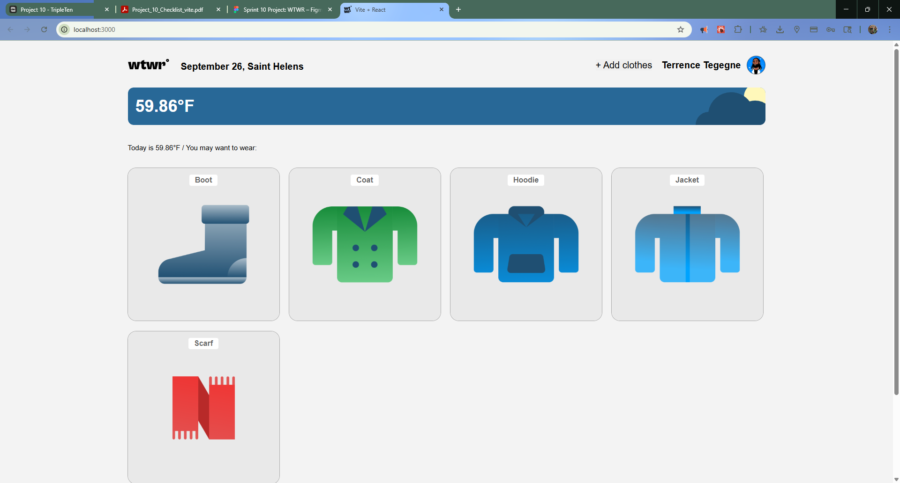
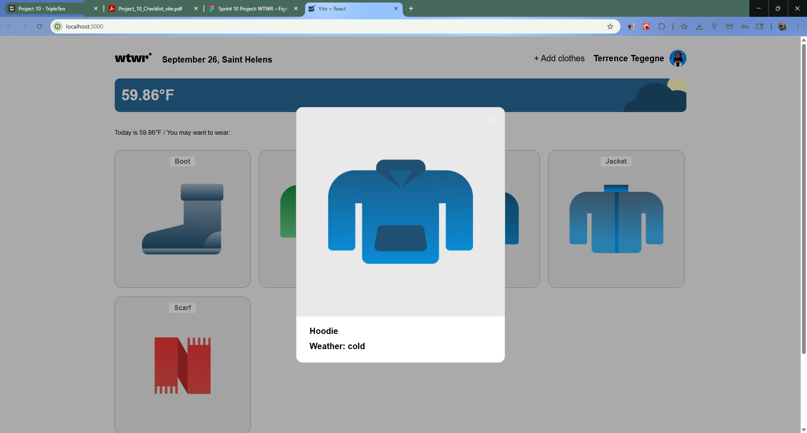
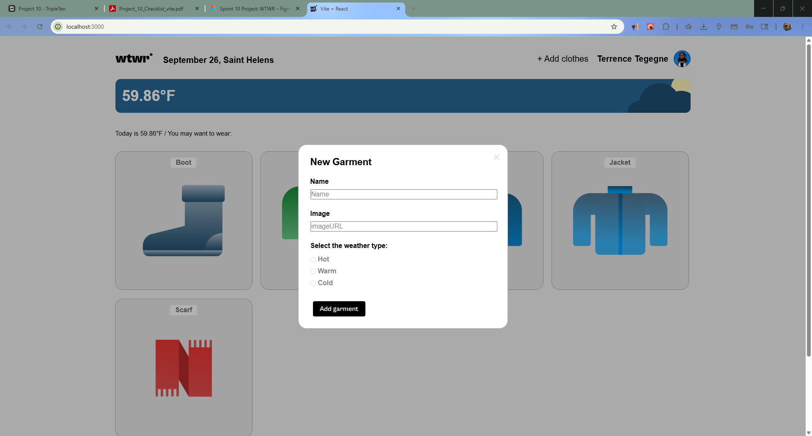

# WTWR (What to Wear?)

## About the project

The idea of the application is pretty simple - we make a call to an API, which then responds with the daily weather forecast. We collect the weather data, process it, and then based on the forecast, we recommend suitable clothing to the user using React + JavaScript. Designed with dynamic weather cards based on data gathered from an API.

## Links

- [Figma Design](https://www.figma.com/file/DTojSwldenF9UPKQZd6RRb/Sprint-10%3A-WTWR)
- [Github](https://JC-codes.github.io/se_project_react)

