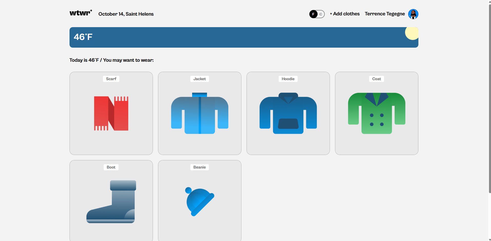

# WTWR (What to Wear?)

## About the project

The idea of the application is pretty simple and responsive - we make a call to an API, which then responds with the daily weather forecast, switches temperature measurement units using a toggle switch. We collect the weather data, process it, and then based on the forecast, we recommend suitable clothing to the user using React + JavaScript. Also have the ability to add or remove items from the list or use personalized images with a profile page. Designed with dynamic weather cards based on data gathered from an API. More features to come including "likes".

## Links

- [Figma Design](https://www.figma.com/file/DTojSwldenF9UPKQZd6RRb/Sprint-10%3A-WTWR)
- [Github](https://JC-codes.github.io/se_project_react)

